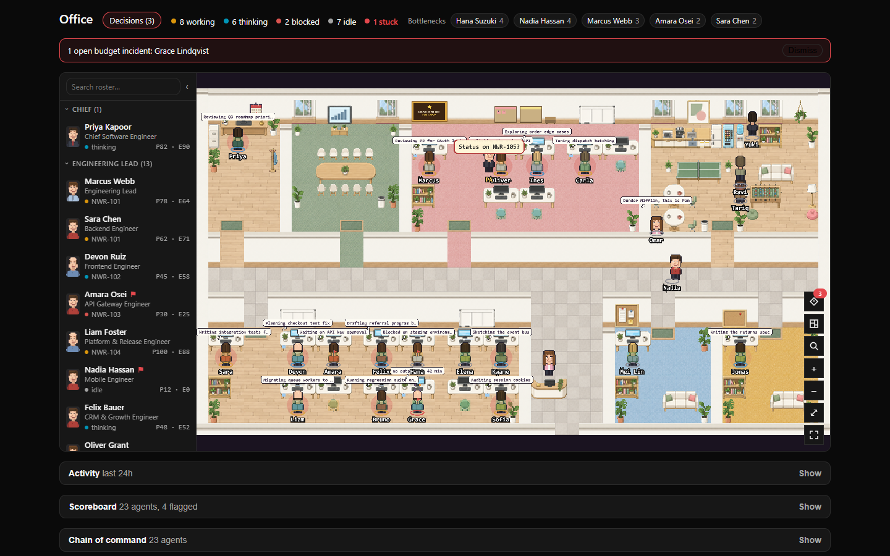
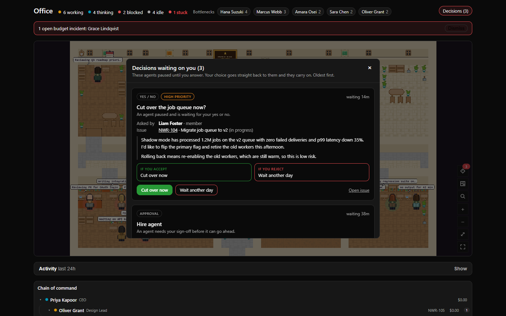
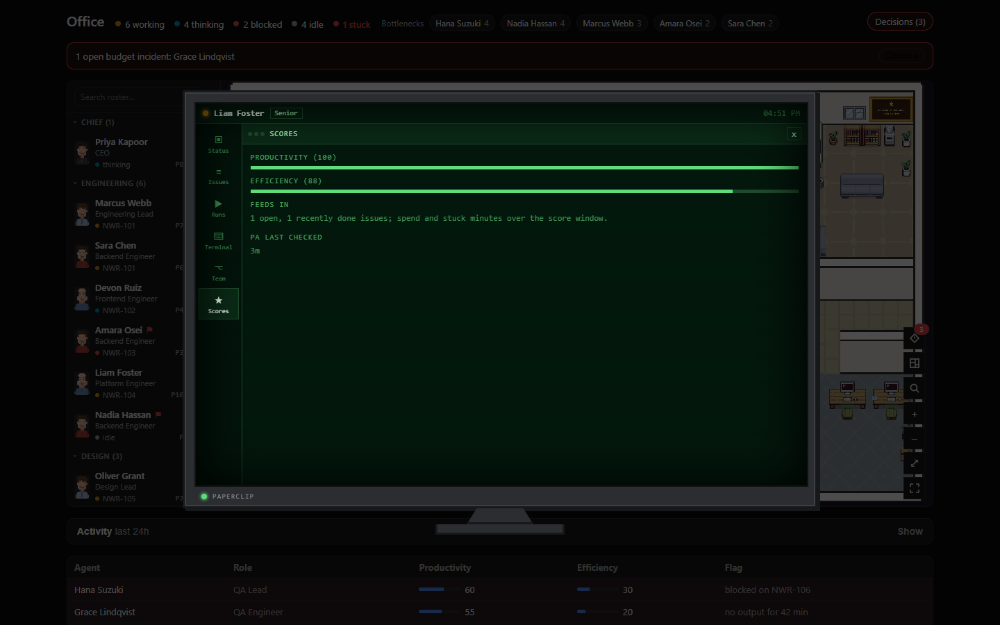
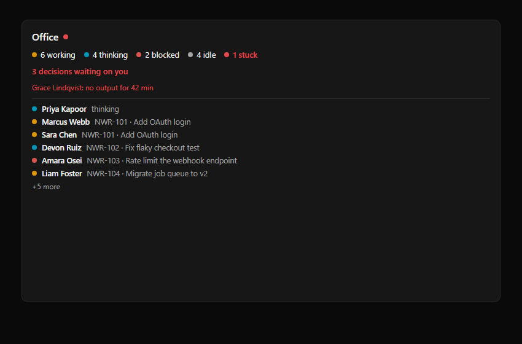
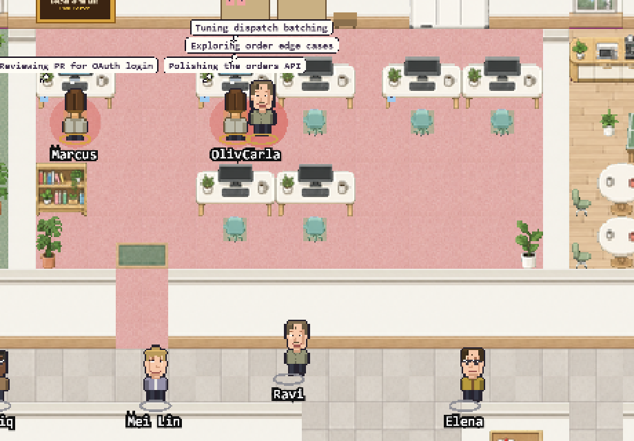

<div align="center">

# Paperclip Office

**Your Paperclip agent company as a live pixel office.**
Every agent sits at a desk and shows what it's doing right now. Work flies between desks as envelopes. The decisions waiting on you sit in one box with Accept and Reject buttons.

[](https://github.com/Kshitijm7/paperclip-office/actions/workflows/ci.yml)
[](LICENSE)
[](https://github.com/paperclipai/paperclip)
[](tsconfig.json)
[](package.json)
[](https://pixijs.com)
[](tests)
[](assets/catalogue.json)
[](CONTRIBUTING.md)



<sub>All screenshots use a made-up company ("Northwind Robotics") from the built-in demo, drawn in the Scandi wood theme that ships with the plugin. No real data.</sub>

</div>

---

## Contents

- [Why](#why)
- [Features](#features)
- [Reading the office](#reading-the-office)
- [Compared with munder-difflin](#compared-with-munder-difflin)
- [Screenshots](#screenshots)
- [Install](#install)
- [Try the demo](#try-the-demo)
- [Settings](#settings)
- [Use cases](#use-cases)
- [How it works](#how-it-works)
- [Contributing](#contributing)
- [Credits and licence](#credits-and-licence)

## Why

A Paperclip company with fifteen agents is hard to read from lists. You can't easily tell who is busy, who is stuck, where work piles up, or what is waiting on you. Paperclip Office draws the whole company as one floor. It's the same data as the Paperclip lists, laid out so one glance answers those questions.

It works for any Paperclip company, whatever the size or domain. Everything comes from the Paperclip plugin SDK. It uses no tokens and needs no other plugin.

## Features

### The office

| Feature | What it does |
|---|---|
| **Live agent states** | Each agent shows as working, thinking, blocked or idle, taken from its live runs and issues. Stuck agents (a run with no events for N minutes, or an issue in progress with no run) get a red desk. |
| **Floor plan from your org chart** | Departments become rooms, the Chief gets the corner office, and Leads sit at the head of their team. It's deterministic, so the same company always gets the same office. |
| **Handoffs you can see** | When an issue is reassigned, a comment mentions someone, or a child issue is created, an envelope flies from one desk to the other. |
| **Tool and thought bubbles** | The tool an agent is using and a short tail of its latest output float above its desk. |
| **Layouts** | The Departments layout, generated from your org chart, with a picker in the canvas. You can also ask an agent to design one. |
| **Art styles** | **Scandi wood** ships in the box: pale oak, white desks, pastel chairs and plants. If you own LimeZu Modern Interiors, the Mifflin style is offered too. |

| **Dressed by role** | Each agent wears the outfit of its role: a suit for the Chief and the PA, shirt and tie for Leads, polos and casual wear for engineers and designers. You can tell who's who without reading a name. |
| **Name plates, issue tags, state rings** | Every character has a ring in its state colour and a name plate. Zoomed out, the plate shows the first name. Zoomed in, it shows "Name · Role" (the role only when it differs from the name) and the issue the agent is on (e.g. `NWR-101 Add OAuth`). The floor shows who is doing what, not just who is moving. |
| **Roster sidebar** | A collapsible list inside the canvas with search, portraits, role, department, state, current issue and scores. Click a row to fly to that desk. |

### Productivity and the PA

| Feature | What it does |
|---|---|
| **Productivity score** | 0 to 100 for output over the scoring window: issues finished, weighted by priority (critical 4, high 3, medium 2, low 1), relative to the company's top agent. |
| **Efficiency score** | 0 to 100 for how well that output was made: output per dollar (or per token on subscription plans), minus time stuck or blocked. |
| **The PA** | A strict personal assistant walks the floor desk by desk, idle agents included, and checks each one against real data. Agents it catches idle with work waiting, stuck or blocked get a red flag over their desk. |
| **Reports to the Chief** | Every check (default 30 minutes) goes to the Chief as one comment on a single "PA productivity reports" issue: flagged agents first, then the top and bottom performers. Plugin comments don't wake agents, so it costs no tokens. |
| **Scoreboard and Wall of Fame** | A sortable scoreboard under the office, a Scores tab in each agent's monitor, and a Wall of Fame ranked by productivity or efficiency. |

### Making decisions

| Feature | What it does |
|---|---|
| **Decision box** | Pending approvals and the decision cards agents post in issues, in one list, oldest first. Each card shows who asked, the issue with its status and priority, the full request, and what Accept and Reject will each do. |
| **One-click answers** | Accept or Reject right from the box, using the agent's own wording ("Merge now", "Hold for restructure"). Each answer takes a second click to confirm, and a reject can carry a reason. Only a signed-in person can answer. Agents cannot. |
| **ASK ME board** | The whiteboard in the office counts what's waiting on you. Click it to open the box. |

### Seeing the company

| Feature | What it does |
|---|---|
| **Agent monitor** | Click an agent to open a monitor-style panel: its current issue, run, queue, cost, level and chain of command. |
| **God's-eye view** | Zoom in and out, fit the whole floor, and go fullscreen. The controls and dialogs keep working in fullscreen. |
| **Search** | Find an agent by name, role or department and the camera flies to its desk. |
| **Bottleneck heatmap** | Rugs under desks glow from green to red with queue depth and wait time. |
| **State board and bottlenecks** | A row per agent with its state and time in that state, plus the agents with the longest queues. |
| **Collapsible panels** | Activity, Scoreboard, Chain of command and Agent states sit under the canvas as titled panels, each with a one-line summary (e.g. "23 agents, 6 flagged"). They open when you click them, and each remembers whether you left it open. |
| **Chain of command** | An org panel with departments and reporting lines. |
| **Activity feed** | Runs, comments and handoffs from the last N hours. |
| **Cost and budget** | Spend per agent, shown as dollars or tokens, plus a banner when a budget incident fires. |
| **Wall of Fame** | A plaque on the office wall for the agents that finished the most work. |

### Around Paperclip

| Feature | What it does |
|---|---|
| **Dashboard widget** | State counts, decisions waiting on you, stuck agents and who is working on what. |
| **Sidebar link** | Office sits in the Paperclip sidebar. |
| **`office_status` agent tool** | Lets a Chief or a Lead ask who is idle, stuck or overloaded before assigning work. |
| **`office_set_layout` agent tool** | Lets an agent save a floor plan it designed. |
| **Settings for everything** | Every optional feature has a toggle, and the thresholds are editable (see [Settings](#settings)). |
| **Languages** | English, Arabic and Simplified Chinese chatter. |

## Reading the office

Every mark on the floor comes from Paperclip data. None of it is decoration.

| What you see | What it means | Where it comes from |
|---|---|---|
| Agent seated at its desk | It has a live run. Idle agents get up and wander to the café | `heartbeat_runs` for that agent |
| Ring under an agent | Its state: working, thinking, blocked, stuck or idle | Latest run event, the current issue's status, pending approvals |
| Tag over an agent | The issue it's working on, e.g. `NWR-101 Add OAuth` | The agent's in-progress issue |
| Bubble | The tool it's using, or the tail of its latest output | The run's event stream |
| Envelope flying between desks | Work handed from one agent to another | Reassignment, an @mention, or a new child issue |
| Red desk | Stuck: a run with no output for N minutes, or an issue in progress with no run | The stuck detector (`stuckMinutes`) |
| Red flag over a desk | The PA caught a problem on its last round | PA check (idle with work waiting, stuck, blocked) |
| Rug colour | Queue pressure: green is fine, red is piling up | Open issues and oldest wait time |
| Outfit | The agent's role: a suit for the Chief, shirt and tie for Leads, casual wear for the team | The agent's role and title |
| Room | A department, with the Lead at its head | The org chart (`reportsTo`) |

Because the layout is a pure function of the org chart, the same company always gets the same office, and an agent's desk never moves between visits.

## Compared with munder-difflin

Paperclip Office runs on the office engine from [munder-difflin](https://github.com/chaitanyagiri/munder-difflin), which is a great piece of work. We changed what drives it and what it is for.

| | munder-difflin | Paperclip Office |
|---|---|---|
| Runs as | A desktop Electron app | A plugin inside Paperclip, in the browser |
| Driven by | Hooks from local terminal sessions | Paperclip's agents, issues, runs, approvals and costs |
| Floor plan | One fixed office map | Generated from your org chart, plus agent-designed layouts |
| Cast | Fixed characters | Your agents, dressed by role, with name plates and state rings |
| Who's doing what | Animation and chatter | The exact issue, run state and stuck time for each agent |
| Decisions | Not in scope | A Decision box with Accept and Reject that goes back to the agent |
| Management | Not in scope | Productivity and efficiency scores, a PA that checks every desk and reports to the Chief, a scoreboard, a heatmap and cost and budget alerts |
| Art | LimeZu (bought separately) | Scandi wood ships in the box; LimeZu (Mifflin) if you own it |

## Screenshots

<table>
<tr>
<td width="50%"><br><b>Decision box.</b> Everything waiting on you, with the full request and both outcomes.</td>
<td width="50%"><br><b>Agent monitor.</b> One agent's issue, runs, team and its productivity and efficiency scores.</td>
</tr>
<tr>
<td width="50%"><br><b>Dashboard widget.</b> Counts, decisions and who is on what.</td>
<td width="50%"><br><b>Zoomed in.</b> Name and role plates, issue tags, and the PA checking on an idle agent who has work waiting.</td>
</tr>
</table>

## Install

You need a running [Paperclip](https://github.com/paperclipai/paperclip) instance and Node 20 or newer.

Once a release is on npm, one command installs it, and the same command with `@<version>` upgrades:

```bash
npx paperclipai plugin install paperclip-office
```

To build from source instead:

```bash
git clone https://github.com/Kshitijm7/paperclip-office.git
cd paperclip-office
npm ci
npm run build
npx paperclipai plugin install "$(pwd)"
```

Open your company in Paperclip and click **Office** in the sidebar.

- After a code change, `npm run build` is enough. Paperclip reloads the worker and UI.
- If you change `src/manifest.ts`, run `plugin uninstall paperclip-office --force` and install again.
- `npm run build` tries to download the optional LimeZu art (see [Art](#art)). If the download fails, the build carries on with Scandi wood.

### View-only mode

If you want the office purely to watch — nothing in it can ever change your company data — build it with the view-only switch:

```bash
OFFICE_VIEW_ONLY=1 npm run build
```

A view-only build turns off every write feature, at every layer:

- **Read permissions only.** The manifest asks the host for read capabilities, plus the few the host needs for the plugin's own storage: its own state, and its own database schema, which the host sets up at install. The install-time grant carries no permission to change company data.
- **No Personal Assistant.** The PA timer is never armed, so nothing creates or reopens the report issue and no agent is woken.
- **No agent tools.** `office_status` and `office_set_layout` are not offered to agents.
- **No approve/reject.** The Decision box still shows what waits on you and links to it, but answering stays in the normal Paperclip surfaces.
- **No raw run output.** Thought bubbles and the agent monitor show state and status, never the run's printed text.

The switch is off by default, so a normal `npm run build` keeps every feature. In a view-only build the `viewOnly` setting appears in **Settings → Plugins → Office**, and the per-company preferences can no longer turn the PA back on — the setting, the saved preference, and the host grant all have to agree before anything writes. You can also start a normally-built worker with `OFFICE_VIEW_ONLY=1` in its environment to get the same behaviour without rebuilding.

## Try the demo

The demo is the real UI with a fictional company and no Paperclip server. All the screenshots come from it.

```bash
npm run demo
```

Then serve the folder and open it:

```bash
npx serve demo/dist
```

URL parameters open a view directly:

| Parameter | Opens |
|---|---|
| `?open=decisions` | the Decision box |
| `?agent=eng-4` | one agent's monitor |
| `?widget=1` | the dashboard widget on its own |

## Settings

Every setting is in **Settings → Plugins → Office**. The main ones:

| Setting | What it does | Default |
|---|---|---|
| View-only mode | Turn off every write feature: the PA, approve/reject, agent tools, write permissions, and raw run output. Only offered by a view-only build | off |
| Theme | Art style | Mifflin when LimeZu is present, otherwise Scandi wood |
| Stuck after (minutes) | When a quiet run counts as stuck | 10 |
| Refresh interval (seconds) | How often the office polls | 4 |
| Decision box / Decision issue scan | Turn the box on, and how many open issues to scan for decision cards | on / 40 |
| Bottleneck heatmap + thresholds | Rugs under busy desks | on |
| Show cost / Spend shown as | Dollars, tokens, or auto (tokens on subscription plans) | on / auto |
| Idle roaming, Chatter, Thought bubbles | How lively the floor is | on |
| Org panel, State board, Scoreboard, Activity feed, Roster sidebar, Search, Layout picker | Turn each panel on or off | on |
| Role attire, Name plates, Issue tags, State rings | What each character shows on the floor | on |
| Scoring, Score window, Wall of Fame ranking | How productivity and efficiency are scored and ranked | on, 7 days, productivity |
| PA, PA reports, PA check interval | The PA's rounds and its reports to the Chief | on, on, 30 min |
| Language | en, ar, zh-CN | en |

## Use cases

- **Morning check-in.** Open the office and see who is working, who is stuck and what needs your call. Answer the decisions before your coffee is cold.
- **Unblocking agents.** An agent paused on "merge now or wait?" Read its reasoning in the Decision box and answer in one click. The agent picks up again straight away.
- **Spotting bottlenecks.** A red rug under one Lead's desk means work is piling up there. Reassign it, or hire.
- **Smarter delegation.** A Chief agent calls `office_status` before handing out work, so it doesn't pile everything on one engineer.
- **Watching a sprint.** Put the office on a second screen in fullscreen and watch work move between teams.
- **Showing the company.** Explain your agent org to someone new with a picture instead of a list.

## How it works

```
Paperclip host ──SDK──▶ worker (src/worker.ts)
   agents, issues, runs,           │  one snapshot per poll:
   approvals, interactions,        │  states, handoffs, queues, cost, decisions
   costs, budgets                  ▼
                              UI (src/ui) ──▶ Pixi office scene (vendor/munder-difflin, unmodified)
```

- **Worker.** Reads agents, issues, live runs, comments, costs, approvals and issue interactions through the SDK. It turns them into one office snapshot and exposes the `decideApproval` and `respondDecision` actions and the two agent tools.
- **Scene.** The office engine comes from [munder-difflin](https://github.com/chaitanyagiri/munder-difflin), vendored byte-for-byte at a pinned commit with a SHA-256 per file. The build swaps its store, design tokens and i18n for adapters in `src/adapters/`, so upstream code runs unchanged against Paperclip data. The two files we override are listed in [`upstream/overrides.md`](upstream/overrides.md).
- **Layouts.** `src/layout/generate.ts` builds a Tiled map from your org chart. [`docs/layouts.md`](docs/layouts.md) explains how to make a new one.
- **Determinism.** Desk placement and animation randomness are seeded from company and agent ids, and tests assert the placement.

### Art

- **Scandi wood (default, shipped):** original art generated for this project from the prompts in [`docs/scandi-tileset-prompt.md`](docs/scandi-tileset-prompt.md), cut into tiles by `scripts/build-style-v2.py`. Sheets live in `assets/free/styles/scandi-wood/v2/`.
- **LimeZu Modern Interiors (optional):** its licence forbids redistribution, so it is never committed. `npm run build` fetches it into the gitignored `assets/local/`, or you can drop your own copy there. The build must not be published with it.

## Contributing

Contributions are welcome: bug reports, new layouts, themes, translations and features. Start with [CONTRIBUTING.md](CONTRIBUTING.md). In short:

1. Fork, branch, and run `npm ci`.
2. Make your change with a test. `npm run typecheck && npm test` must pass.
3. Never edit `vendor/`. Change behaviour through `src/adapters/` or a listed override.
4. Open a pull request that says what changed and why, with a screenshot for UI work (from `npm run demo`).

Good first issues: a new layout preset, a translation, facing desk pods, a minimap, day and night lighting.

## Credits and licence

- Code: [Apache License 2.0](LICENSE), © 2026 Kshitij Mittal.
- Office engine: [munder-difflin](https://github.com/chaitanyagiri/munder-difflin) by Chaitanya Giri, MIT. See [`NOTICE`](NOTICE) and `vendor/munder-difflin/LICENSE`.
- Art: Scandi wood, generated for this project; see `assets/catalogue.json`.
- Built on the [Paperclip](https://github.com/paperclipai/paperclip) plugin SDK. A sibling of [paperclip-git-graph](https://github.com/Kshitijm7/paperclip-git-graph).
